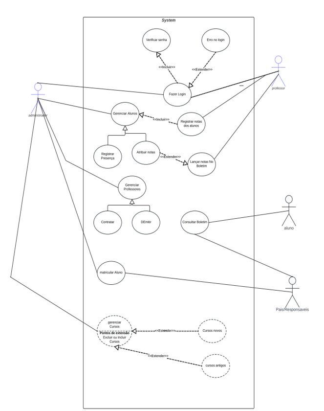
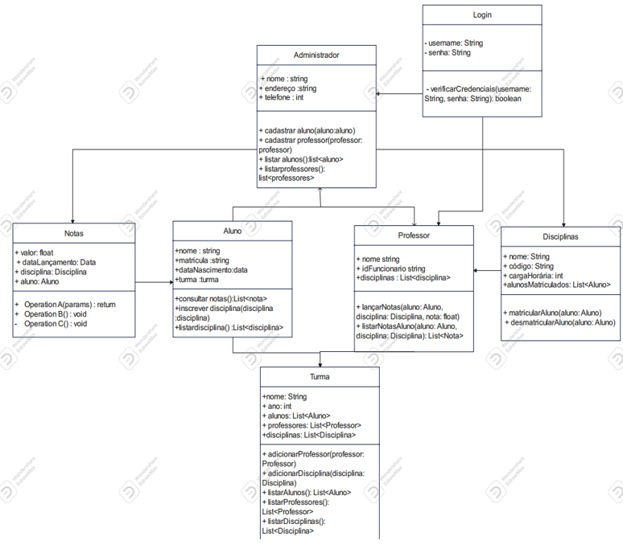
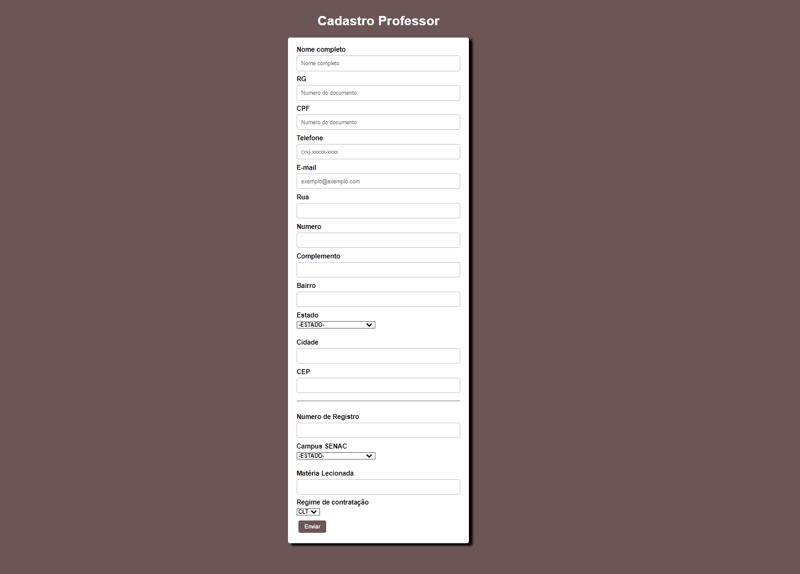
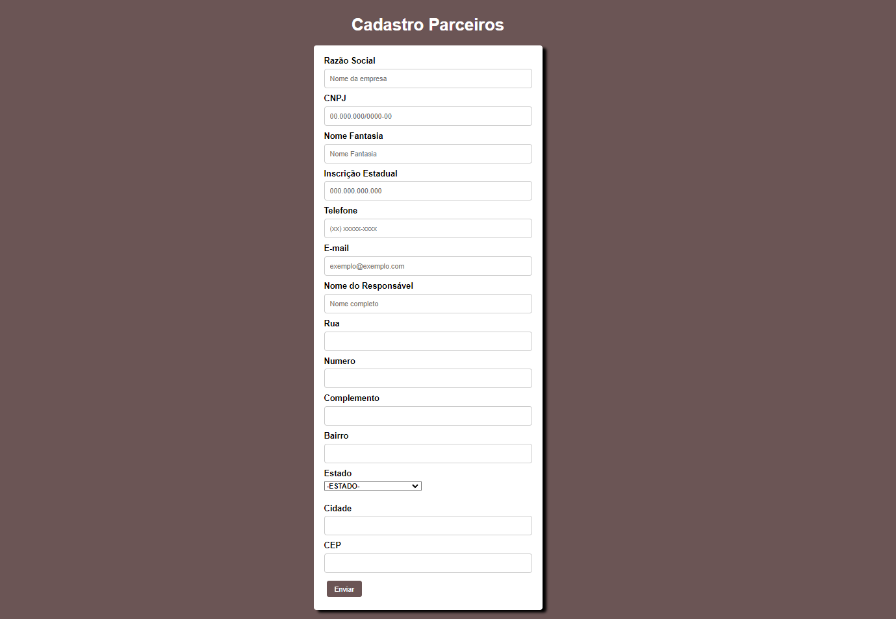
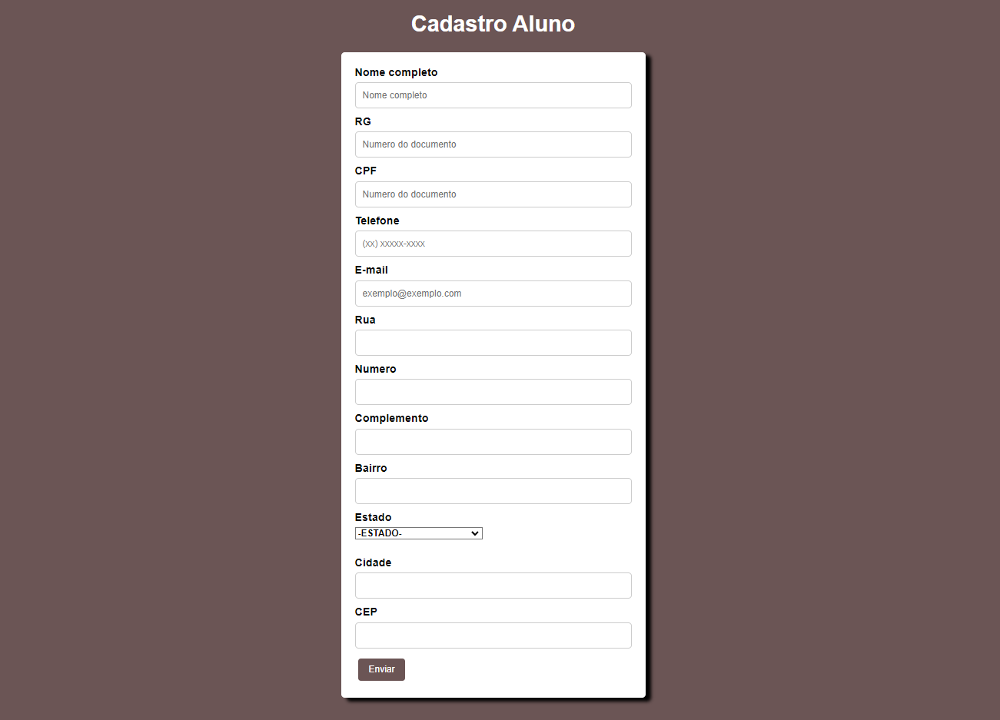
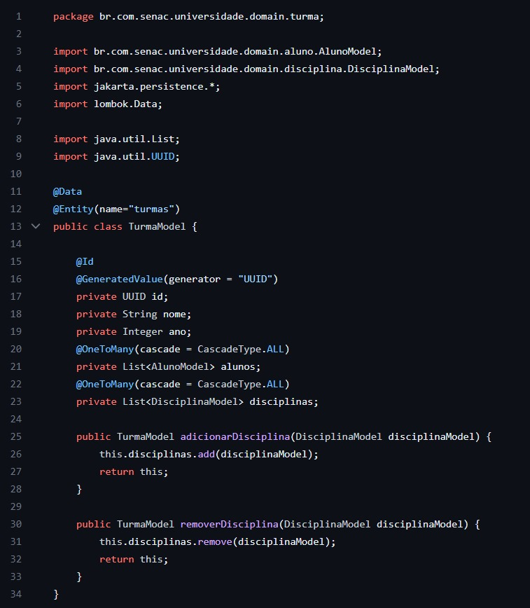
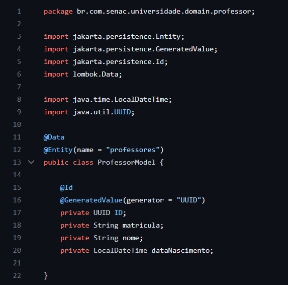
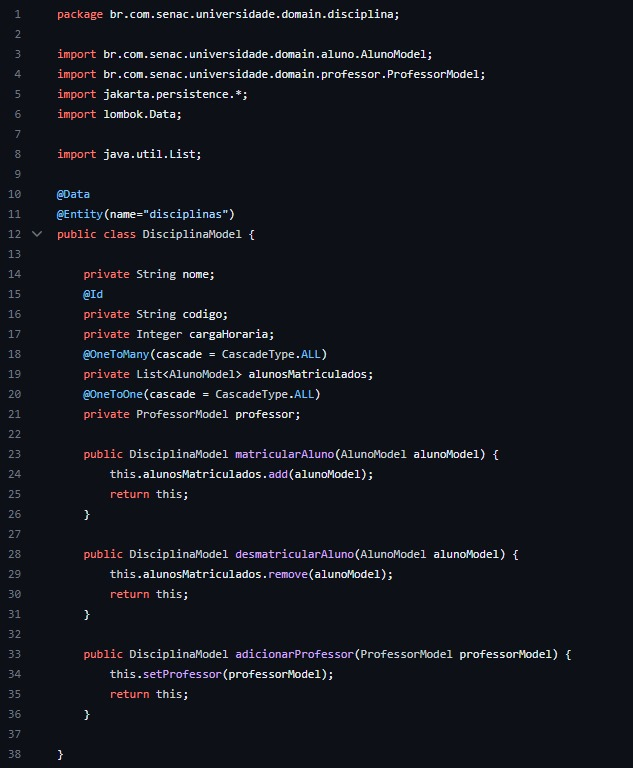
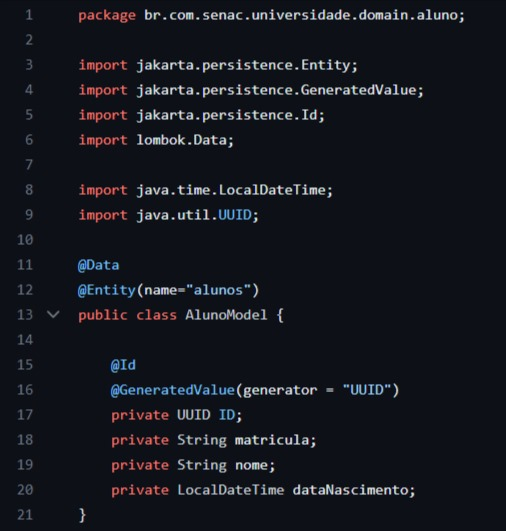

# Desenvolvimento de uma modelagem de projeto voltado a gestão de dados de um centro universitário. 

A modelagem do projeto foi pensando para uma melhor estruturação de uma gestão de dados de um centro universitário. Através dos conceitos de elaboração de projetos da UML foi desenvolvimento um protótipo capaz de representar o cadastro de diferentes tipos de pessoas em um sistema de universidade.

O diagrama de casos de uso tem como função exemplificar como os usuários interagem com os sistemas e como usuários secundários se relacionam com outros usuários. O diagrama de classes serve de estrutura e para se observar a relação das classes que irão servir de modelo
para objetos. 

&nbsp;

## Diagrama de casos de uso

&nbsp;

### Diagrama de classes

&nbsp;

## Interface do trabalho

&nbsp;

Através dos diagramas foi elaborado uma interface do trabalho utilizando html e css.

&nbsp;

### Sobre o projeto

&nbsp;

### Página inicial

&nbsp;

&nbsp;

### Página inicial

&nbsp;

### Login e senha

&nbsp;

### Cadastro professor

&nbsp;

### Cadastro parceiros

&nbsp;

### Cadastro alunos

&nbsp;

## Classes do trabalho (backend)

&nbsp;

Nessa parte do trabalho foi utilizado a linguagem de programação Java para criar as classes da gestão de dados do centro universitário

&nbsp;

### Domain turma

&nbsp;

### Domain professor

&nbsp;

### Domain disciplina

&nbsp;

### Domain aluno

